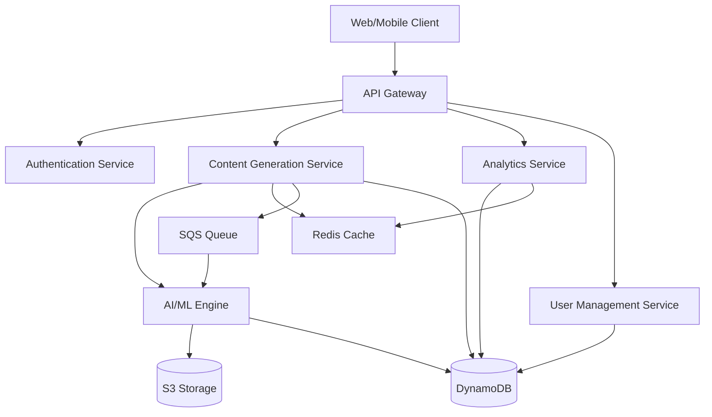

# Design Document: ContentSpark

## Overview

ContentSpark is a cloud-native, AI-powered content generation platform built on AWS infrastructure. The system uses a microservices architecture to provide scalable, multilingual content generation with intelligent audience targeting and engagement prediction.

The platform leverages AWS services including Lambda for serverless compute, DynamoDB for data persistence, API Gateway for RESTful APIs, S3 for content storage, and integrates with AI/ML services for content generation and analysis. The architecture is designed for high availability, automatic scaling, and cost-effective operation.

Key design principles:
- Serverless-first architecture for automatic scaling and cost optimization
- Event-driven processing for asynchronous operations
- Separation of concerns between content generation, analytics, and user management
- Stateless API design for horizontal scalability
- Caching strategies for performance optimization

## Architecture

### High-Level Architecture



### Service Architecture

The system is composed of four primary microservices:

1. **Authentication Service**: Handles user registration, login, OAuth integration, and session management
2. **Content Generation Service**: Orchestrates AI content generation, manages requests, and applies business rules
3. **Analytics Service**: Aggregates metrics, generates reports, and provides dashboard data
4. **User Management Service**: Manages user profiles, preferences, and subscription data

### Data Flow

1. User submits content request through API Gateway
2. Authentication Service validates session token
3. Content Generation Service receives request and checks cache
4. If not cached, request is queued for AI processing
5. AI/ML Engine generates content based on parameters
6. Generated content is scored for engagement prediction
7. Results are cached and stored in DynamoDB
8. Analytics Service asynchronously updates metrics
9. Response returned to client with content and metadata

## Components and Interfaces

### 1. API Gateway Layer

**Responsibilities:**
- Route incoming HTTP requests to appropriate services
- Enforce rate limiting and throttling
- Handle CORS and API versioning
- Validate request schemas

**Endpoints:**

```
POST   /api/v1/auth/register
POST   /api/v1/auth/login
POST   /api/v1/auth/logout
GET    /api/v1/auth/oauth/{provider}

POST   /api/v1/content/generate
GET    /api/v1/content/{id}
POST   /api/v1/content/improve
POST   /api/v1/content/export
POST   /api/v1/content/copy

GET    /api/v1/analytics/dashboard
GET    /api/v1/analytics/trends
GET    /api/v1/analytics/summary

GET    /api/v1/user/profile
PUT    /api/v1/user/profile
GET    /api/v1/user/preferences
PUT    /api/v1/user/preferences
```

### 2. Authentication Service

**Interface:**

```typescript
interface AuthService {
  register(email: string, password: string): Promise<UserToken>
  login(email: string, password: string): Promise<UserToken>
  logout(token: string): Promise<void>
  validateToken(token: string): Promise<User>
  oauthLogin(provider: string, code: string): Promise<UserToken>
  refreshToken(refreshToken: string): Promise<UserToken>
}

interface UserToken {
  accessToken: string
  refreshToken: string
  expiresIn: number
  userId: string
}

interface User {
  id: string
  email: string
  role: UserRole
  createdAt: Date
  lastLogin: Date
}

enum UserRole {
  USER = "user",
  ADMIN = "admin"
}
```

**Implementation Details:**
- Uses AWS Cognito for user pool management
- JWT tokens with 24-hour expiration
- Refresh tokens stored in DynamoDB with 30-day expiration
- OAuth integration with Google and LinkedIn via Cognito Identity Providers
- Failed login attempts tracked in DynamoDB with automatic lockout after 5 attempts

### 3. Content Generation Service

**Interface:**

```typescript
interface ContentGenerationService {
  generateContent(request: ContentRequest): Promise<ContentResponse>
  improveContent(contentId: string, suggestion: string): Promise<ContentResponse>
  getContent(contentId: string): Promise<ContentItem>
  exportContent(contentIds: string[], format: ExportFormat): Promise<ExportResult>
}

interface ContentRequest {
  userId: string
  platform: Platform
  audienceType: AudienceType
  tone: Tone
  language: Language
  topic: string
  additionalContext?: string
}

enum Platform {
  INSTAGRAM = "instagram",
  LINKEDIN = "linkedin",
  WHATSAPP = "whatsapp",
  EMAIL = "email"
}

enum AudienceType {
  STUDENTS = "students",
  BUSINESSES = "businesses",
  CREATORS = "creators"
}

enum Tone {
  FOMO = "fomo",
  INSPIRATIONAL = "inspirational",
  PROFESSIONAL = "professional",
  URGENT = "urgent"
}

enum Language {
  ENGLISH = "en",
  HINDI = "hi",
  TAMIL = "ta",
  TELUGU = "te",
  BENGALI = "bn",
  MARATHI = "mr",
  GUJARATI = "gu",
  KANNADA = "kn"
}

interface ContentResponse {
  contentId: string
  content: string
  metadata: ContentMetadata
  engagementScore: EngagementScore
  suggestions: ImprovementSuggestion[]
  generatedAt: Date
}

interface ContentMetadata {
  platform: Platform
  audienceType: AudienceType
  tone: Tone
  language: Language
  wordCount: number
  characterCount: number
  hashtags?: string[]
}

interface EngagementScore {
  score: number  // 0-100
  confidence: number  // 0-1
  factors: ScoreFactor[]
}

interface ScoreFactor {
  name: string
  impact: number  // -10 to +10
  description: string
}

interface ImprovementSuggestion {
  id: string
  category: SuggestionCategory
  description: string
  expectedImpact: number  // estimated score improvement
  reasoning: string
}

enum SuggestionCategory {
  TONE = "tone",
  LENGTH = "length",
  KEYWORDS = "keywords",
  STRUCTURE = "structure",
  CALL_TO_ACTION = "call_to_action"
}

interface ContentItem {
  id: string
  userId: string
  content: string
  metadata: ContentMetadata
  engagementScore: EngagementScore
  createdAt: Date
  updatedAt: Date
}

enum ExportFormat {
  TEXT = "text",
  JSON = "json",
  CSV = "csv"
}

interface ExportResult {
  format: ExportFormat
  data: string | object
  filename: string
  size: number
}
```

**Implementation Details:**
- Lambda function orchestrates content generation workflow
- Checks Redis cache for similar requests (cache key: hash of request parameters)
- Cache TTL: 1 hour for generated content
- Queues requests to SQS when AI processing is needed
- AI/ML Engine implemented using AWS Bedrock (Claude or GPT models)
- Prompt engineering templates stored in S3, organized by platform/audience/tone
- Generated content stored in DynamoDB with GSI on userId and createdAt
- Engagement scoring uses a separate Lambda function with ML model
- Content generation timeout: 30 seconds with exponential backoff retry

### 4. AI/ML Engine

**Interface:**

```typescript
interface AIEngine {
  generateContent(prompt: GenerationPrompt): Promise<string>
  scoreEngagement(content: string, context: ContentContext): Promise<EngagementScore>
  suggestImprovements(content: string, score: EngagementScore, context: ContentContext): Promise<ImprovementSuggestion[]>
  translateContent(content: string, targetLanguage: Language): Promise<string>
}

interface GenerationPrompt {
  systemPrompt: string
  userPrompt: string
  temperature: number
  maxTokens: number
  stopSequences?: string[]
}

interface ContentContext {
  platform: Platform
  audienceType: AudienceType
  tone: Tone
  language: Language
}
```

**Implementation Details:**
- Uses AWS Bedrock with Claude 3 Sonnet for content generation
- Prompt templates structured with platform-specific guidelines
- Temperature: 0.7 for creative content, 0.3 for professional content
- Max tokens: 500 for Instagram, 1000 for LinkedIn, 300 for WhatsApp, 1500 for Email
- Engagement scoring model: Fine-tuned BERT model deployed on SageMaker
- Model trained on historical engagement data (likes, shares, comments)
- Improvement suggestions generated using GPT-4 with structured output
- Translation uses AWS Translate with custom terminology for Indian languages
- Fallback to Google Translate API if AWS Translate doesn't support language pair

### 5. Analytics Service

**Interface:**

```typescript
interface AnalyticsService {
  getDashboard(userId: string, filters: AnalyticsFilters): Promise<Dashboard>
  getTrends(userId: string, metric: MetricType, period: TimePeriod): Promise<TrendData>
  getSummary(userId: string, dateRange: DateRange): Promise<AnalyticsSummary>
  recordEvent(event: AnalyticsEvent): Promise<void>
}

interface AnalyticsFilters {
  dateRange?: DateRange
  platform?: Platform
  audienceType?: AudienceType
  language?: Language
}

interface DateRange {
  startDate: Date
  endDate: Date
}

interface Dashboard {
  totalContentGenerated: number
  averageEngagementScore: number
  contentByPlatform: Record<Platform, number>
  contentByAudience: Record<AudienceType, number>
  contentByLanguage: Record<Language, number>
  topPerformingContent: ContentItem[]
  recentActivity: AnalyticsEvent[]
}

interface TrendData {
  metric: MetricType
  period: TimePeriod
  dataPoints: DataPoint[]
}

enum MetricType {
  CONTENT_COUNT = "content_count",
  AVG_ENGAGEMENT_SCORE = "avg_engagement_score",
  PLATFORM_USAGE = "platform_usage"
}

enum TimePeriod {
  DAILY = "daily",
  WEEKLY = "weekly",
  MONTHLY = "monthly"
}

interface DataPoint {
  timestamp: Date
  value: number
  label?: string
}

interface AnalyticsSummary {
  totalContent: number
  averageScore: number
  mostUsedPlatform: Platform
  mostUsedTone: Tone
  mostUsedLanguage: Language
  improvementRate: number  // % of content that was improved
}

interface AnalyticsEvent {
  eventType: EventType
  userId: string
  contentId?: string
  metadata: Record<string, any>
  timestamp: Date
}

enum EventType {
  CONTENT_GENERATED = "content_generated",
  CONTENT_IMPROVED = "content_improved",
  CONTENT_EXPORTED = "content_exported",
  CONTENT_COPIED = "content_copied"
}
```

**Implementation Details:**
- DynamoDB table with composite key (userId, timestamp) for time-series queries
- GSI on eventType for aggregation queries
- Lambda function processes events from SQS queue asynchronously
- Pre-aggregated metrics stored in separate DynamoDB table for fast dashboard loading
- Aggregation runs every 5 minutes via EventBridge scheduled rule
- Redis cache for dashboard data with 5-minute TTL
- CloudWatch metrics for system-level monitoring

### 6. User Management Service

**Interface:**

```typescript
interface UserManagementService {
  getProfile(userId: string): Promise<UserProfile>
  updateProfile(userId: string, updates: ProfileUpdates): Promise<UserProfile>
  getPreferences(userId: string): Promise<UserPreferences>
  updatePreferences(userId: string, preferences: UserPreferences): Promise<UserPreferences>
  deleteAccount(userId: string): Promise<void>
}

interface UserProfile {
  id: string
  email: string
  name?: string
  organization?: string
  role: UserRole
  subscriptionTier: SubscriptionTier
  createdAt: Date
  lastLogin: Date
}

interface ProfileUpdates {
  name?: string
  organization?: string
}

interface UserPreferences {
  defaultPlatform?: Platform
  defaultAudienceType?: AudienceType
  defaultTone?: Tone
  defaultLanguage?: Language
  emailNotifications: boolean
  analyticsEnabled: boolean
}

enum SubscriptionTier {
  FREE = "free",
  BASIC = "basic",
  PREMIUM = "premium",
  ENTERPRISE = "enterprise"
}
```

**Implementation Details:**
- User data stored in DynamoDB with userId as partition key
- Preferences stored as nested JSON document
- Account deletion triggers Step Functions workflow to clean up all user data
- Cleanup includes: content items, analytics events, cached data, and auth tokens
- Soft delete with 7-day grace period before permanent deletion

## Data Models

### DynamoDB Tables

**1. Users Table**

```
Partition Key: userId (String)
Attributes:
  - email (String)
  - passwordHash (String)
  - name (String)
  - organization (String)
  - role (String)
  - subscriptionTier (String)
  - preferences (Map)
  - createdAt (Number - Unix timestamp)
  - lastLogin (Number - Unix timestamp)
  - failedLoginAttempts (Number)
  - accountLockedUntil (Number - Unix timestamp)
```

**2. Content Table**

```
Partition Key: contentId (String)
Sort Key: userId (String)
GSI: userId-createdAt-index
  - Partition Key: userId
  - Sort Key: createdAt
Attributes:
  - content (String)
  - platform (String)
  - audienceType (String)
  - tone (String)
  - language (String)
  - wordCount (Number)
  - characterCount (Number)
  - hashtags (List<String>)
  - engagementScore (Number)
  - engagementConfidence (Number)
  - scoringFactors (List<Map>)
  - createdAt (Number)
  - updatedAt (Number)
  - ttl (Number - for automatic cleanup after 30 days)
```

**3. Analytics Events Table**

```
Partition Key: userId (String)
Sort Key: timestamp (Number - Unix timestamp)
GSI: eventType-timestamp-index
  - Partition Key: eventType
  - Sort Key: timestamp
Attributes:
  - eventType (String)
  - contentId (String)
  - metadata (Map)
  - ttl (Number - for cleanup after 12 months)
```

**4. Aggregated Metrics Table**

```
Partition Key: userId (String)
Sort Key: metricKey (String - format: "metric#period#timestamp")
Attributes:
  - metricType (String)
  - period (String)
  - value (Number)
  - aggregatedAt (Number)
  - ttl (Number)
```

**5. Sessions Table**

```
Partition Key: sessionToken (String)
Attributes:
  - userId (String)
  - refreshToken (String)
  - createdAt (Number)
  - expiresAt (Number)
  - ttl (Number - DynamoDB TTL for automatic cleanup)
```

### S3 Bucket Structure

```
content-spark-assets/
├── prompts/
│   ├── instagram/
│   │   ├── students-fomo.txt
│   │   ├── students-inspirational.txt
│   │   └── ...
│   ├── linkedin/
│   ├── whatsapp/
│   └── email/
├── models/
│   └── engagement-scorer/
│       └── model.tar.gz
└── exports/
    └── {userId}/
        └── {exportId}.{format}
```

### Redis Cache Structure

```
Keys:
- content:request:{hash}  -> ContentResponse (TTL: 1 hour)
- dashboard:{userId}      -> Dashboard (TTL: 5 minutes)
- user:profile:{userId}   -> UserProfile (TTL: 15 minutes)
- rate:limit:{userId}     -> Number (TTL: 1 hour, for rate limiting)
```

## Error Handling

### Error Categories

1. **Validation Errors (400)**
   - Invalid request parameters
   - Missing required fields
   - Invalid enum values
   - Malformed JSON

2. **Authentication Errors (401)**
   - Invalid or expired token
   - Missing authentication header
   - Invalid credentials

3. **Authorization Errors (403)**
   - Insufficient permissions
   - Account locked
   - Subscription tier limitations

4. **Rate Limiting Errors (429)**
   - Too many requests
   - API quota exceeded

5. **Server Errors (500)**
   - AI service unavailable
   - Database connection failure
   - Unexpected exceptions

6. **Service Unavailable (503)**
   - Maintenance mode
   - Downstream service timeout

### Error Response Format

```typescript
interface ErrorResponse {
  error: {
    code: string
    message: string
    details?: Record<string, any>
    requestId: string
    timestamp: Date
  }
}
```

### Error Handling Strategy

- All Lambda functions wrapped with try-catch blocks
- Errors logged to CloudWatch with structured logging
- Request IDs tracked through X-Ray for distributed tracing
- Exponential backoff for retryable errors (AI service timeouts, DynamoDB throttling)
- Circuit breaker pattern for external service calls
- Dead letter queues for failed SQS messages
- CloudWatch alarms for error rate thresholds
- Graceful degradation: return cached content if AI service unavailable

### Retry Logic

```typescript
interface RetryConfig {
  maxAttempts: number
  initialDelayMs: number
  maxDelayMs: number
  backoffMultiplier: number
  retryableErrors: string[]
}

const defaultRetryConfig: RetryConfig = {
  maxAttempts: 3,
  initialDelayMs: 100,
  maxDelayMs: 5000,
  backoffMultiplier: 2,
  retryableErrors: [
    'ServiceUnavailable',
    'ThrottlingException',
    'RequestTimeout'
  ]
}
```

## Testing Strategy

### Unit Testing

Unit tests will focus on:
- Individual service methods with mocked dependencies
- Input validation logic
- Error handling paths
- Data transformation functions
- Prompt template generation
- Engagement score calculation logic
- Cache key generation
- Export format conversion

Testing framework: Jest for TypeScript/Node.js services

### Property-Based Testing

Property-based tests will validate universal correctness properties across all inputs using fast-check library. Each property test will run a minimum of 100 iterations with randomized inputs.

Tests will be tagged with format: **Feature: content-spark, Property {N}: {property_text}**

Property tests will cover:
- Content generation consistency across parameter combinations
- Engagement score bounds and calculation properties
- Data serialization round-trips
- API request/response schema validation
- Cache consistency properties
- Rate limiting enforcement
- Authentication token lifecycle

### Integration Testing

Integration tests will verify:
- End-to-end API workflows
- Service-to-service communication
- Database operations with test DynamoDB tables
- S3 file operations
- SQS message processing
- Authentication flows including OAuth

### Load Testing

Load tests using Artillery or k6:
- 1000 concurrent users generating content
- Sustained load for 30 minutes
- Spike tests with sudden traffic increases
- Verify auto-scaling behavior
- Monitor Lambda cold starts and optimization

### Security Testing

- OWASP Top 10 vulnerability scanning
- Penetration testing for authentication bypass
- SQL injection attempts (though using DynamoDB)
- XSS and CSRF protection verification
- API rate limiting validation
- Token expiration and refresh flow testing

## Correctness Properties

A property is a characteristic or behavior that should hold true across all valid executions of a system—essentially, a formal statement about what the system should do. Properties serve as the bridge between human-readable specifications and machine-verifiable correctness guarantees.

The following properties will be validated through property-based testing using the fast-check library, with each test running a minimum of 100 iterations.

### Property 1: Platform-Specific Content Generation

*For any* valid content request with a specified platform, the generated content should include platform-specific formatting characteristics appropriate for that platform (hashtags for Instagram, professional structure for LinkedIn, messaging format for WhatsApp, subject line for Email).

**Validates: Requirements 1.1**

### Property 2: Audience-Appropriate Vocabulary

*For any* valid content request with a specified audience type, the generated content should use vocabulary and references appropriate for that audience (casual/educational for students, professional/business-focused for businesses, creative/platform-specific for creators).

**Validates: Requirements 2.1**

### Property 3: Valid Parameter Combinations

*For any* combination of valid Platform, Audience_Type, and Tone values, the system should accept the request and generate content without errors.

**Validates: Requirements 2.5, 3.6**

### Property 4: Tone-Appropriate Content

*For any* valid content request with a specified tone, the generated content should reflect that emotional style in its language and structure.

**Validates: Requirements 3.1**

### Property 5: Language-Correct Output

*For any* valid content request with a specified target language, the generated content should be primarily in that language (allowing for platform-specific elements like hashtags).

**Validates: Requirements 4.2**

### Property 6: Translation Preservation

*For any* generated content that is translated to another language, the translated version should maintain the same platform formatting structure and tone characteristics as the original.

**Validates: Requirements 4.4**

### Property 7: Mixed-Language Handling

*For any* content request with mixed-language input, the system should process it without errors and produce valid output in the target language.

**Validates: Requirements 4.5**

### Property 8: Engagement Score Bounds and Structure

*For any* generated content, the engagement score should be between 0 and 100 (inclusive), and should include a confidence value between 0 and 1.

**Validates: Requirements 5.1, 5.4**

### Property 9: Content Ranking by Score

*For any* set of multiple generated content variations, when ranked by engagement score, each item should have a score greater than or equal to the next item in the list.

**Validates: Requirements 5.5**

### Property 10: Low-Score Improvement Suggestions

*For any* generated content with an engagement score below 70, the system should provide at least 3 improvement suggestions.

**Validates: Requirements 6.1**

### Property 11: Suggestion Structure Completeness

*For any* improvement suggestion provided by the system, it should include a category field (tone, length, keywords, structure, or call_to_action) and a reasoning field with non-empty text.

**Validates: Requirements 6.2, 6.4**

### Property 12: Suggestion Application Effect

*For any* content and improvement suggestion, applying the suggestion should result in regenerated content that differs from the original content.

**Validates: Requirements 6.3**

### Property 13: Analytics Filter Application

*For any* valid analytics filter (date range, platform, audience type), the dashboard data returned should only include content matching the filter criteria.

**Validates: Requirements 7.4**

### Property 14: Export Format Validity

*For any* content item and export format (text, JSON, CSV), the exported data should be valid for that format and parseable by standard parsers.

**Validates: Requirements 8.3**

### Property 15: Export Metadata Completeness

*For any* exported content, the export should include all required metadata fields: platform, audience type, tone, language, engagement score, and timestamp.

**Validates: Requirements 8.4**

### Property 16: Bulk Export Consistency

*For any* set of content IDs requested for bulk export, the export should include exactly those content items (no more, no less) in the specified format.

**Validates: Requirements 8.5**

### Property 17: Unauthenticated Request Rejection

*For any* content generation API request without a valid authentication token, the system should reject the request with a 401 status code.

**Validates: Requirements 9.1**

### Property 18: Input Validation for Registration

*For any* registration request with an invalid email format or weak password (less than 8 characters, no special characters), the system should reject the request with appropriate error messages.

**Validates: Requirements 9.2**

### Property 19: Session Token Expiration

*For any* successful login, the system should create a session token with an expiration time exactly 24 hours from creation.

**Validates: Requirements 9.4**

### Property 20: Role-Based Access Control

*For any* administrative API endpoint request from a non-admin user, the system should reject the request with a 403 status code.

**Validates: Requirements 9.5**

### Property 21: Cache Hit Consistency

*For any* content request that is repeated with identical parameters within the cache TTL period, the second request should return the same content as the first request.

**Validates: Requirements 10.5**

### Property 22: Content TTL Configuration

*For any* generated content item stored in DynamoDB, the TTL field should be set to 30 days from creation time (unless explicitly saved by user).

**Validates: Requirements 11.3**

### Property 23: API Rate Limiting Enforcement

*For any* user making more than 100 API requests within a 1-hour window, the 101st request should be rejected with HTTP 429 status code.

**Validates: Requirements 11.6**

### Property 24: API Error Response Format

*For any* invalid API request (missing required fields, invalid authentication, etc.), the error response should be valid JSON containing error code, message, requestId, and timestamp fields.

**Validates: Requirements 12.2**

### Property 25: Response JSON Serialization Round-Trip

*For any* valid content response object, serializing to JSON and then deserializing should produce an equivalent object with all metadata preserved.

**Validates: Requirements 12.3**

### Property 26: Rate Limit Error Headers

*For any* API request that exceeds rate limits, the response should include both HTTP 429 status code and a retry-after header indicating when the user can retry.

**Validates: Requirements 12.6**

